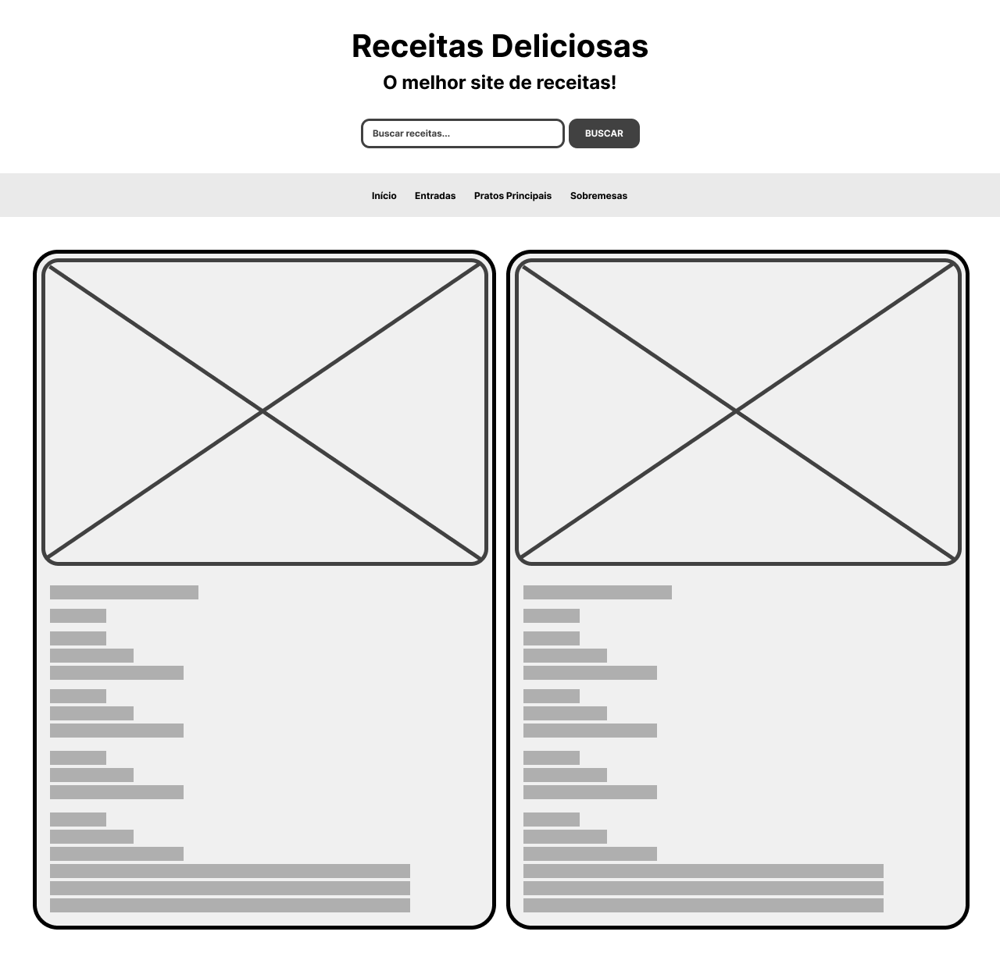

# Trabalho Prático - Semana 03

Dessa vez, vamos escolher uma proposta de projeto para trabalhar. Na [lista de propostas de projetos](propostas-projetos.md), escolha um dentre as alternativas.

Nessa atividade, você deverá montar a página inicial do projeto escolhido, a organização do HTML aplicando semântica correta e uso aprimorado do CSS. Leia o enunciado completo no Canvas para mais detalhes.

**IMPORTANTE:** Você deve trabalhar e alterar apenas arquivos dentro da pasta **`public`**. Deixe todos os demais arquivos e pastas desse repositório inalterados. **PRESTE MUITA ATENÇÃO NISSO.**

## Informações Gerais

- Nome: Pedro Niess
- Matricula: 1540911
- Proposta de projeto escolhida: Diretório de Receitas
- Breve descrição sobre seu projeto: Este projeto é um site de receitas culinárias organizado por categorias, incluindo entradas, pratos principais e sobremesas. Ele permite que os usuários busquem receitas pelo nome ou ingredientes, favoritem suas favoritas e visualizem detalhes completos de cada prato. O design é inspirado em uma estética moderna e intuitiva, garantindo uma navegação agradável e eficiente.

## Print do esboço criada

## Print da home-page criada

